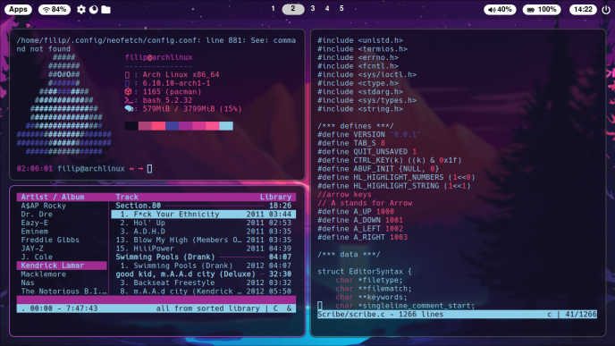

# dotfiles
## disclaimer 
I am new to ricing, arch linux and this kind of stuff so treat lightly

## basic info: 
OS: Linux  
Distro: Arch (I use arch btw)  
Terminal: Alacritty  
WM : Hyprland  
login-manager: lightdm (with webkit2)  
device: Lenovo Laptop, PC (custom)  

## here are some pictures now:

